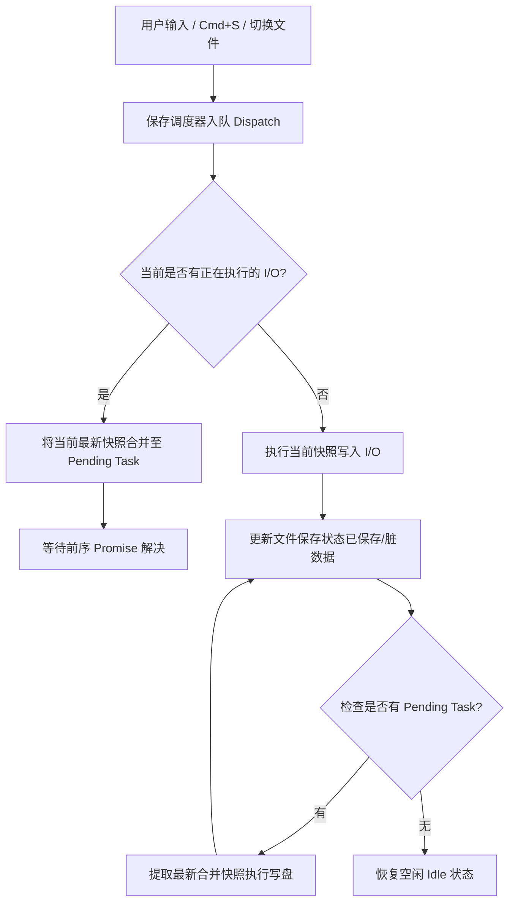

# 代码库模块化拆分、并发保序保存调度与多端发版架构方案

## 1. 背景与设计目标

随着 Inkpoint（md-editor）功能向跨平台桌面应用、Web 在线体验端（Playground）以及官网文档生态演进，代码库规模逐步扩大。为了保障系统的**人类可读性（Human-readable）**与**人类可维护性（Human-maintainable）**，遵循第一性原理和架构边界设计原则，系统实施了一次全面的结构重构与文档规范升级。

### 核心目标
1. **消灭巨型单体文件**：拆分行数过多（>800行）且职责混杂的巨型模块，按关注点分离（Separation of Concerns）进行子目录化拆解；
2. **全量补全架构与业务注释**：所有跨层调用、核心数据流转、复杂算法与异步状态管理，必须配齐清晰的中文注释；
3. **并发保序保存调度设计**：在 `@md-editor/editor-core` 层收敛文件自动保存与手动保存的并发调度逻辑，避免异步 I/O 竞争与数据覆盖；
4. **多端发布与更新日志解耦**：将更新日志拆分为桌面端专属日志与 Web 在线版专属日志，官网通过双 Tab 独立展示；消除向后兼容包袱，统一发版脚本至 `release:*` 命名空间。

---

## 2. 核心领域模块化拆解

### 2.1 类型系统模块化 (`packages/editor-core/src/types/`)
- **原状**：原 `packages/editor-core/src/types.ts` 超过 1045 行，混杂了文档模型、编辑器模式、UI 事件、设置项与 AI 交互类型。
- **拆解方案**：
  - `document.ts`：文档模型、元数据、Frontmatter、保存状态契约；
  - `editor.ts`：编辑器实例、模式枚举（所见即所得 / 源码）、选区与滚动位置；
  - `settings.ts`：用户偏好设置（外观、编辑器行为、自动保存间隔、字体等）；
  - `ai.ts`：AI 补全、润色建议、流式推理协议；
  - `events.ts`：编辑器总线事件、快捷键分发、生命周期钩子；
  - `view.ts`：CodeMirror 视图状态、DOM 挂载与投影层配置；
  - `index.ts`：统一 re-export 所有子模块，保持外部 `import ... from '@md-editor/editor-core'` 100% 零破坏兼容。

### 2.2 设置面板组件拆解 (`packages/editor-ui/src/components/SettingsModal/`)
- **原状**：原 `SettingsModal.tsx` 达 943 行，单组件承载所有设置 Tab（通用、外观、编辑器行为、AI 配置、关于）的状态与渲染逻辑，难以维护与扩展。
- **拆解方案**：
  - `SettingsModal.tsx`：仅负责对话框容器、外层动画遮罩、Tab 导航栏切换与全局确认取消行为；
  - `tabs/GeneralTab.tsx`：常规设置（自动保存、语言、更新检测等）；
  - `tabs/AppearanceTab.tsx`：外观设置（主题切换、字体、窗口玻璃拟态 Liquid Glass 开关等）；
  - `tabs/EditorTab.tsx`：编辑器行为（行号、换行折叠、空格缩进、打字机模式等）；
  - `tabs/AiTab.tsx`：AI 接入模型选择、API 密钥管理与自定义端点配置；
  - `tabs/AboutTab.tsx`：软件版本、版权声明与开源协议展示。

### 2.3 语法保真提取器拆解 (`packages/markdown-fidelity/src/extractor/`)
- **原状**：原 `extractor.ts` 超过 840 行，包含了 Markdown 语法树所有特殊语法块的解析提取与反向序列化。
- **拆解方案**：
  - `base.ts`：公共解析上下文、字符偏移量换算与 AST 遍历工具；
  - `frontmatter.ts`：YAML Frontmatter 提取与纯净剥离；
  - `codeBlock.ts`：围栏代码块（Fenced Code Blocks）与元信息解析；
  - `table.ts`：GFM 复杂表格对齐规则与列信息提取；
  - `directive.ts`：扩展容器指令（Callout / Alert）；
  - `mdx.ts`：JSX 节点与内联 MDX 组件隔离提取。

### 2.4 桌面端平台接口拆解 (`apps/desktop/src/backend/`)
- **拆解方案**：
  - 将与 Tauri Rust 后端直接交互的 IPC 通信拆分为独立子模块：文件 I/O 代理、系统剪贴板监听、窗口行为控制、外部文件关联与系统托盘管理；
  - 为所有跨 FFI / IPC 接口添加完备的双语类型契约与异常处理策略。

---

## 3. 并发保序保存调度器架构 (Serialized Save Queue)

### 3.1 痛点与第一性原理
在日常 Markdown 编辑场景中，文件保存事件来源多样且频率极高：
- **防抖自动保存 (Debounced Auto-save)**：用户连续键盘输入，每隔一定时间（如 1000ms）触发异步写盘；
- **手动显式保存 (Explicit Save)**：用户按下 `Cmd+S` / `Ctrl+S` 或点击保存按钮，期望立即落盘；
- **文档生命周期切换**：用户切换活跃标签页、关闭当前文档或切换工作区目录；
- **窗口失焦与退出**：窗口失焦（Blur）或应用退出前触发强制同步落盘。

如果仅使用朴素的 `async/await`，当一次耗时较长的磁盘 I/O（例如大文件或云同步目录）尚未完成时，后续的保存请求若先行完成，将导致**写覆盖（Lost Update）**或**状态不一致（Race Condition）**。

### 3.2 架构设计
调度器由 `@md-editor/editor-core` 统一实现，具有以下设计契约：



1. **链式串行队列（Promise Chain Serialization）**：
   - 每个打开的文档（按 `fileId` 或绝对路径隔离）拥有独立的串行执行链；
   - 保证物理磁盘写入严格保序，前序写入未完成前，后续写入绝不会并发抢占。
2. **中间态请求折叠（Coalescing & Superseding）**：
   - 若前序写入正在进行中，队列中积压的多次自动保存请求会自动折叠，只保留最新一份文档内容快照；
   - 手动触发的保存请求（`priority: 'high'`）会立即刷新防抖计时器并挂载在最新排队位置。
3. **平台抽象与同构契约**：
   - 调度核心不依赖具体的 Tauri 或 Node.js 文件 API；
   - 通过注入 `IFileSystemAdapter` 驱动底层写盘：
     - **Desktop**：通过 Tauri IPC 调用 Rust 底层原子写（Atomic Write，先写临时文件再原子重命名，防止崩溃导致文件损坏）；
     - **Web**：通过 IndexedDB、OPFS（Origin Private File System）或内存虚拟文件系统写入。

---

## 4. 多端发布与更新日志解耦架构

### 4.1 独立更新日志管理
为了解决桌面端和 Web 端特性演进速率不同、版本号独立的问题，将原来单一根目录 `CHANGELOG.md` 升级为按端隔离：
- **`apps/desktop/CHANGELOG.md`**：记录 macOS、Windows、Linux 原生桌面端更新历史（根目录 `CHANGELOG.md` 保持镜像同步）；
- **`apps/web/CHANGELOG.md`**：记录 Web 在线 Playground 编辑器版本的特性演进与更新日志；
- **`site` 官网展示**：官网更新日志页面（`/changelog`）升级为双 Tab 架构，用户可在「桌面客户端」与「Web 在线版」之间自由切换阅读。

### 4.2 工整的 `release:*` 发版命令命名空间
全面消除历史向后兼容别名，统一为对称、清晰的发版命令体系：

```
pnpm release:desktop           # 交互式发布桌面端（版本号、双Changelog、commit、v* tag 与 push）
pnpm release:desktop:version   # 仅更新桌面端相关版本文件与更新日志
pnpm release:web               # 交互式发布 Web 端（版本号、web Changelog、构建自检、commit、web-v* tag 与 push）
pnpm release:web:version       # 仅更新 Web 端版本文件与更新日志
pnpm release:site              # 官网部署上线（Vercel CLI 预构建发布）
```

### 4.3 Git Tag 触发与 CI/CD 路由契约
- **Desktop 客户端触发**：推送 `v*` tag（例如 `v0.10.2`）触发 `.github/workflows/release-desktop.yml`，执行 macOS、Linux、Windows 三端矩阵构建与 GitHub Release / Homebrew tap 发布；
- **Web 在线端触发**：推送 `web-v*` tag（例如 `web-v0.2.0`）触发 `.github/workflows/release-web.yml`，执行 Web 端产物打包压缩与 GitHub Release 发布。
