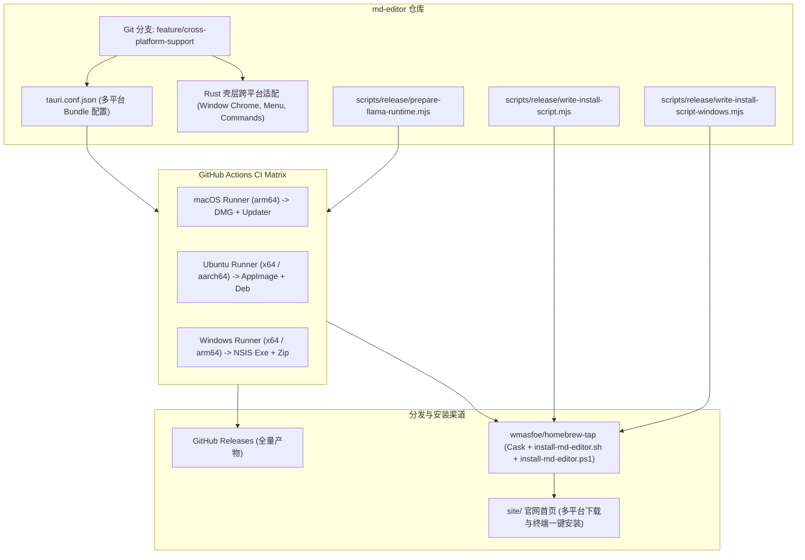

# Linux 与 Windows 平台支持、ARM 架构与终端一键安装方案

用途：记录 `md-editor` 支持 Linux (x86_64, aarch64/ARM64) 与 Windows (x64, ARM64) 平台、多架构打包、终端一键安装脚本（Shell / PowerShell）以及 CI/CD Matrix 构建发布的完整设计与执行规范。

## 1. 目标与设计原则

### 1.1 核心目标
1. **多平台多架构覆盖**：
   - **Linux**：支持 `x86_64` 与 `aarch64` (ARM64)，生成 `.AppImage`（通用免依赖）与 `.deb` 安装包。
   - **Windows**：支持 `x64` 与 `arm64` (ARM64)，生成 NSIS `.exe` 安装包与便携版 `.zip`。
   - **macOS**：保持现有 Apple Silicon (`arm64`) 构建完全不受影响（遵守 Non-Goal 契约）。
2. **终端一键安装体验**：
   - **macOS & Linux 统一入口**：
     ```bash
     curl -fsSL https://raw.githubusercontent.com/wmasfoe/homebrew-tap/main/install-md-editor.sh | sh
     ```
     自动检测操作系统（Darwin / Linux）与 CPU 架构（x86_64 / aarch64），在 Linux 下自动下载 AppImage、设置可执行权限、部署至 `~/.local/share/md-editor/`、软链接至 `~/.local/bin/md-editor`、并注册 `~/.local/share/applications/md-editor.desktop` 桌面图标。
   - **Windows 专属入口**：
     ```powershell
     irm https://raw.githubusercontent.com/wmasfoe/homebrew-tap/main/install-md-editor.ps1 | iex
     ```
     自动检测处理器架构（`AMD64` vs `ARM64`），下载 NSIS 安装包并静默安装至用户目录。
3. **Local AI Sidecar 架构一致性**：
   - 保持与 macOS 一致的安装包内置 Sidecar 模式。
   - 通过 CI 准备脚本 `scripts/release/prepare-llama-runtime.mjs`，在构建打包前按 Target Triple 拉取官方 `llama-server` 预编译二进制打入安装包。
   - 代码层保持缺省时的优雅降级与防御性容错。

---

## 2. 架构拓扑与数据流



---

## 3. 详细设计与改动清单

### 3.1 Tauri 跨平台打包配置 (`apps/desktop/src-tauri/tauri.conf.json`)
- **多 Bundle 目标**：
  - `bundle.targets`：根据平台支持 `dmg`, `app`, `appimage`, `deb`, `nsis`, `zip`。
  - `bundle.linux.deb.depends`：配置标准 WebKitGTK/GTK3 运行时依赖。
  - `bundle.linux.appimage.bundleMediaFramework`：根据需要启用媒体框架打包。
  - `bundle.windows.nsis.installMode`：设置 `"currentUser"`，避免普通用户安装时弹出 UAC 提权。

### 3.2 Rust 壳层跨平台适配
- `apps/desktop/src-tauri/src/file_commands.rs`：
  - `open_with_system_default` / `reveal_file_tree_item_in_finder`：
    - macOS: `open` / `open -R`
    - Windows: `explorer.exe /select,<path>`
    - Linux: `xdg-open <dir>` 或 D-Bus 文件管理器接口
- `apps/desktop/src-tauri/src/window_chrome.rs`：
  - 交通灯与自定义标题栏 inset 严格限制在 `#[cfg(target_os = "macos")]`，Windows / Linux 采用标准原生边框或无装饰窗体。
- `apps/desktop/src-tauri/src/text_substitutions.rs`：
  - 保持非 macOS 平台的无操作 stub。
- `apps/desktop/src-tauri/src/app_menu.rs`：
  - 确保菜单栏在 Windows / Linux 原生菜单中不展示 macOS 专属的 App 菜单项，仅保留标准 File / Edit / View / Settings。

### 3.3 Local AI Runtime 准备脚本 (`scripts/release/prepare-llama-runtime.mjs`)
- 职责：根据传入的 `--target`（如 `x86_64-unknown-linux-gnu`、`aarch64-unknown-linux-gnu`、`x86_64-pc-windows-msvc`、`aarch64-pc-windows-msvc`、`aarch64-apple-darwin`）：
  1. 下载对应 release 的 `llama.cpp` 预编译压缩包。
  2. 解压并将 `llama-server` / `llama-server.exe` 放置于 `apps/desktop/src-tauri/binaries/`。
  3. 赋予可执行权限，供 `tauri build` 打包进资源目录。

### 3.4 终端一键安装脚本生成器
- **`scripts/release/write-install-script.mjs`**：
  - 生成 `install-md-editor.sh`，同时兼容 macOS 与 Linux：
    - `uname -s` 检测 `Darwin` -> 执行 macOS DMG 挂载安装流程。
    - `uname -s` 检测 `Linux` -> 检测 `uname -m`（`x86_64` 或 `aarch64` / `arm64`），下载对应 AppImage，校验 sha256，部署至 `~/.local/share/md-editor/`，软链接至 `~/.local/bin/md-editor`，生成 `~/.local/share/applications/md-editor.desktop`。
- **`scripts/release/write-install-script-windows.mjs`**：
  - 生成 `install-md-editor.ps1`：
    - 读取 `$env:PROCESSOR_ARCHITECTURE`，下载对应的 NSIS `Setup.exe`。
    - 校验 sha256。
    - 调用 `Start-Process -FilePath $installer -ArgumentList "/S" -Wait` 完成静默安装。
- **单元测试**：
  - `scripts/release/write-install-script.test.mjs`
  - `scripts/release/write-install-script-windows.test.mjs`

### 3.5 GitHub Actions CI/CD Matrix
- **PR 校验工作流 (`.github/workflows/build-desktop.yml`)**：
  - 矩阵覆盖 `macos-latest`, `ubuntu-latest`, `windows-latest`。
  - 运行 `pnpm lint`, `pnpm typecheck`, `pnpm test`, `cargo test`。
- **Tag Release 发布工作流 (`.github/workflows/release-desktop.yml`)**：
  - 多平台 Matrix 并行打包：
    - macOS arm64 (`macos-latest`)
    - Linux x64 (`ubuntu-24.04`)
    - Linux arm64 (`ubuntu-24.04-arm` 或 cross)
    - Windows x64 (`windows-latest`)
    - Windows arm64 (`windows-latest` cross)
  - 聚合发布作业：
    - 上传全部安装包至 GitHub Release。
    - 同步更新公开 `wmasfoe/homebrew-tap`（Cask、`install-md-editor.sh`、`install-md-editor.ps1`、`md-editor-latest.json`）。
    - 触发官网 changelog 发布。

### 3.6 官网展示适配 (`site/`)
- 更新 `site/app/page.tsx`：
  - 增加多平台一键安装切换器（macOS/Linux 的 `curl | sh` 与 Windows 的 `irm | iex`）。
  - 增加多平台下载直链（macOS DMG、Linux AppImage/Deb、Windows Setup/Zip）。

---

## 4. 验收与验证计划

1. **自动化测试**：
   - `pnpm test:release`：验证多平台安装脚本生成逻辑与哈希校验。
   - `pnpm typecheck` & `pnpm lint`：保证无 TS / Rust / Lint 报错。
   - `pnpm test` & `cargo test`：全套单元测试通过。
2. **多平台编译与打包验证**：
   - 验证 `pnpm tauri build` 在各平台下的配置文件有效性。
3. **安装脚本真机/容器验证**：
   - 在 Linux 环境模拟执行生成的 `install-md-editor.sh`，验证 AppImage 放置与 desktop 文件创建。
   - 验证 `install-md-editor.ps1` 的 PowerShell 语法与参数解析。
