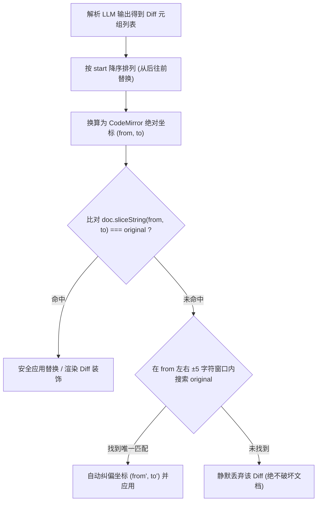

# 端侧专属小模型 (SLM) 紧凑协议与客户端对接规范

用途：记录 `md-editor` 桌面端与自研端侧小模型（`md-editor-models` RFC-002）之间的紧凑协议、Task Control Tokens、紧凑元组 JSON Diff 语法、Unicode 坐标转换算法、Prefix KV Cache 画像拼装规则、CodeMirror 6 三重防御替换流水线、本地与云端模型统一适配架构及本地习惯自学习落地方案。后续维护端侧 SLM、优化编辑器实时审校与 Ghost Text 续写时以此为权威标准。

---

## 1. 背景与核心指标

为了在桌面端实现**极致流畅（首字延迟 TTFT < 30ms）、超低资源占用（内存 < 300MB、磁盘 < 250MB）与 100% 本地离线隐私保护**的 AI 辅助写作体验，端侧放弃了传统的大模型 ChatML 冗长对话与全量 JSON 生成方案，采用专研的轻量垂直小模型（0.35B ~ 0.5B，精简词表）。

| 维度 | 传统通用 LLM 方案 (OpenAI/Claude) | 自研端侧 SLM 紧凑方案 |
| :--- | :--- | :--- |
| **指令协议** | ChatML (`<|im_start|>system...`)，Prefill 需 100+ tokens | **紧凑 Task Control Tokens**，Prefill 仅 1~3ms |
| **输出格式** | 冗长全量对象 JSON 或全句重写，解码 300ms+ | **紧凑元组 JSON（Tuple JSON）**，解码仅 20~30ms |
| **解析方式** | 复杂脆弱的私有正则或大对象解析 | **标准原生 `JSON.parse()` / `serde_json`**，零正则维护负担 |
| **输出合法性** | 易产生代码围栏或废话 | **GBNF / 结构化采样约束**，数学级保障 100% 合法 JSON |
| **无错响应** | 仍输出 `{"hasEdit": false}` 等冗余字段 | **直接输出 `[]` 或 EOS (`<|endoftext|>`)**，1ms 瞬间释放 Slot |
| **画像与习惯** | 每次重复发送 Prompt 导致显存与耗时翻倍 | **Prefix KV Cache 画像常驻** + SQLite 动态提炼 |

---

## 2. 架构分层与职责边界

遵照[能力边界设计原则](./capability_boundary_design_principles.md)，编辑器与多 Provider 之间的整体数据流与模块分工如下：

```txt
React / CodeMirror 6 (packages/renderer-codemirror & apps/desktop)
  ├── 150ms 键入防抖与单点/选区/换行智能分流
  ├── 渲染 Ghost Text (cm-md-ai-ghost-text) 与 Diff 预览装饰 (cm-md-ai-diff-added)
  └── Tab 采纳 / Esc 取消交互，直接消费确定性坐标 (from, to)，派发采纳事件落库 SQLite

@md-editor/ai (packages/ai) 统一适配层
  ├── 1. 本地 SLM 适配：
  │      ├── Task Control Tokens + Prefix Profile (结构 A) + FIM 组装
  │      ├── 元组 JSON 解析器 ([[start, end, "orig", "repl"], ...])
  │      └── Unicode Code Points -> UTF-16 坐标转换
  ├── 2. 云端大模型适配 (OpenAI / Claude / DeepSeek)：
  │      ├── ChatML 提示词组装 (System / User)
  │      └── 三级自适应定位器 (Adaptive Locator：坐标直通 -> 唯一子串 -> 最近邻纠偏)
  └── 3. 三重防御定位校验 (精确比对 -> ±5 字符 Fuzzy Anchor -> 失败丢弃)

Tauri Rust 宿主 (apps/desktop/src-tauri)
  ├── local_ai_runtime.rs: llama-server sidecar 生命周期与 Prefix Prompt Cache
  ├── local_ai_completion.rs: 通过 /completion 与 /infill 原生端口通信 + GBNF 约束
  └── local_ai_learning_db.rs: user_pair_history 本地 SQLite 句对存储
```

---

## 3. 紧凑 Task Control Tokens 与 Prompt 规范

### 3.1 专用控制符清单（Special Tokens）

控制符已固化进模型词表（`added_tokens`），推理引擎禁止将其拆分为子词：

| 任务分类 | 场景 / 语种 | 专用 Control Token |
| :--- | :--- | :--- |
| **语法纠错 (GEC)** | 中文 / 英文 / 日文 / 韩文 / 俄文 / 法文 | `<|task_gec_zh|>`, `<|task_gec_en|>`, `<|task_gec_ja|>`, `<|task_gec_ko|>`, `<|task_gec_ru|>`, `<|task_gec_fr|>` |
| **标点与排版规范** | 盘古之白（中英空格）、全半角标点、直弯引号 | `<|task_punc|>` |
| **行内 FIM 补全** | 前缀 / 后缀 / 中间生成 / 结束标记 | `<|fim_prefix|>`, `<|fim_suffix|>`, `<|fim_middle|>`, `<|fim_end|>` |
| **格式硬保真** | LaTeX 公式、表格、YAML Frontmatter 保护 | `<|task_preserve_format|>` |

### 3.2 动态风格画像与 Prompt 拼装结构（结构 A：画像置顶）

为了让 `llama-server` 能够在纠错、标点与续写等不同任务之间 **100% 永久复用同一个 KV Cache Slot**，且对齐 Qwen2.5-Instruct 微调格式，Prompt 组装规则如下：

#### 纠错 / 标点任务示例：
```text
<|im_start|>user
<|task_gec_zh|>今天天气很好，但是我想出去玩。<|im_end|>
<|im_start|>assistant
```

#### FIM 行内续写任务示例：
```text
<|im_start|>user
[User Style Profile]
- Language: Mixed (zh-en)
- Punctuation: Strict Pangu-spacing

<|fim_prefix|>React 是一个用于构建 Web 客户端<|fim_suffix|>的 JavaScript 库。<|fim_middle|><|im_end|>
<|im_start|>assistant
```

### 3.3 Stop Tokens 动态分流

| 交互场景 | 传递的 Stop Tokens | 行为与耗时 |
| :--- | :--- | :--- |
| **打字停顿行内 Ghost Text** | `["\n", "<|fim_end|>", "<|im_end|>", "<|endoftext|>"]` | 遇到换行立即终止，极速单行补全（<30ms），不破坏版面结构 |
| **主动段落/块级续写** | `["<|fim_end|>", "<|im_end|>", "<|endoftext|>"]` | 允许换行生成多行内容、代码块或 Markdown 列表 |
| **语法纠错 / 标点修复** | `["\n", "<|im_end|>", "<|endoftext|>", "<|fim_prefix|>"]` | 句子纠错完成后立即停止 |

---

## 4. 紧凑元组 JSON Diff 协议规范

### 4.1 核心语法结构

```json
[[<start>, <end>, "<original>", "<replacement>"], ...]
```

* **`start`** (`number`)：修改起点，基于 **Unicode Code Points（0-indexed）**；
* **`end`** (`number`)：修改终点，基于 **Unicode Code Points（0-indexed）**；
* **`original`** (`string`)：待替换的原文内容（标准 JSON 字符串，带转义）；
* **`replacement`** (`string`)：建议替换的新内容（标准 JSON 字符串，带转义）。

### 4.2 四种基础操作类型

1. **标准单处替换**：
   ```json
   [[7, 9, "但是", "所以"]]
   ```
2. **单句多处修改**：
   ```json
   [[0, 2, "今晚", "今天"], [7, 9, "但是", "所以"]]
   ```
3. **边界情况（纯删除 / 纯插入）**：
   * **纯删除（删多余字）**：`[[8, 9, "多余", ""]]`（`replacement` 为 `""`，`start < end`）；
   * **纯插入（补漏字）**：`[[8, 8, "", "补充"]]`（`start === end`，`original` 为 `""`）。
4. **无错误 / 无需修改**：
   ```json
   []
   ```
   *(模型输出 `[]` 或直接命中 EOS `<|endoftext|>`，耗时 1ms)*

### 4.3 为什么「元组 JSON」是最优工程解？

* **零正则、零歧义**：客户端直接调用标准 `JSON.parse()` / `serde_json::from_str()`。即便原文包含公式符号、冒号 `:`、竖线 `|`、引号 `"` 或换行符，全部遵循标准 JSON 转义协议，绝无正则截断与转义碰撞风险；
* **极速低延迟**：`[[7, 9, "但是", "所以"]]` 生成仅占 **10~12 Tokens**，解码耗时稳定在 <50ms；
* **GBNF 强约束**：`llama-server` 通过原生 JSON Schema 状态机约束 Logit 采样，从数学上杜绝代码围栏或多余闲聊。

---

## 5. 定位与安全校验体系：本地 SLM vs 云端通用大模型

### 5.1 统一的领域数据契约

`@md-editor/ai` 向上层编辑器输出统一的数据结构，彻底消除编辑器对底层模型的依赖：

```typescript
export interface ValidatedDiffItem {
  readonly start: number;     // Unicode Code Point 起点
  readonly end: number;       // Unicode Code Point 终点
  readonly utf16From: number; // 换算后的 UTF-16 选区内起点
  readonly utf16To: number;   // 换算后的 UTF-16 选区内终点
  readonly original: string;  // 待替换原文 (安全校验锚点)
  readonly replacement: string; // 建议替换的新内容
  readonly wasAdjusted?: boolean;
}

export interface AiWritingEditSuggestion {
  readonly hasEdit?: boolean;
  readonly original: string;
  readonly replacement: string;
  readonly reason?: string;   // 云端模型提供详细理由，本地 SLM 为空
  readonly start?: number;
  readonly end?: number;
  readonly utf16From?: number;
  readonly utf16To?: number;
  readonly diffs?: readonly ValidatedDiffItem[];
}
```

### 5.2 本地 SLM 定位机制（硬件级精确坐标直通）
* **定位原理**：本地模型经过专项微调，输出的 `start:end` 即为确切物理坐标；
* **原文作用**：`original` 仅作为安全气囊（Assertion），若 `target.slice(utf16From, utf16To) === original` 则立即生效。

### 5.3 云端通用大模型定位机制（三级自适应定位器）
云端通用大模型（GPT-4o、Claude 3.5 Sonnet）因 BPE 分词缺陷，字符计数可能存在 $\pm 1 \sim 2$ 字符的计算偏差。客户端采用三级自适应定位：
1. **第 1 优先级（坐标直通）**：如果模型返回的 `start:end` 校验与 `original` 严格一致，直接采用；
2. **第 2 优先级（唯一子串锁定）**：若无坐标或偏移偏差，但 `original` 在待检句中仅出现一次，直接通过 `indexOf` 唯一锁定；
3. **第 3 优先级（最近邻窗口纠偏）**：若 `original` 出现多次（同词重复），结合模型给出的近似 `start` 在滑动窗口内选取最近邻命中，防止定位错位。

### 5.4 坐标系转换算法 (Unicode Code Points -> UTF-16 Code Units)

```typescript
export function codePointOffsetToUtf16Offset(text: string, codePointIndex: number): number {
  let codePointCount = 0;
  let utf16Offset = 0;

  for (const char of text) {
    if (codePointCount >= codePointIndex) {
      break;
    }
    utf16Offset += char.length; // 常规字符 +1，Emoji/代理对 +2
    codePointCount += 1;
  }

  return utf16Offset;
}
```

### 5.5 三重防御定位与倒序应用机制



1. **强制倒序应用**：按 `start` 从大到小排列，确保前面的替换不会改变后续 Diff 的坐标偏移；
2. **强一致比对**：文档截取文本与 `original` 一致时直接生效；
3. **Fuzzy Anchor 纠偏**：在用户打字导致微小偏移时，利用 $\pm 5$ 字符窗口模糊定位修正；
4. **失败静默丢弃**：匹配失败时丢弃建议，保障用户输入内容绝对安全。

---

## 6. 用户习惯自学习落地方案

### 6.1 本地 SQLite 数据收集 (`user_pair_history`)

在客户端本地 SQLite 数据库中记录用户行为：

```sql
CREATE TABLE IF NOT EXISTS user_pair_history (
    id INTEGER PRIMARY KEY AUTOINCREMENT,
    task_type TEXT NOT NULL,          -- 'GEC', 'PUNCT', 'FIM'
    source_text TEXT NOT NULL,        -- 修改前原文 / 补全上文
    target_text TEXT NOT NULL,        -- 用户采纳或手动保存的最终正文
    created_at DATETIME DEFAULT CURRENT_TIMESTAMP
);
```

* **记录时机**：用户按 Tab 采纳 AI 建议、或用户在 AI 建议生成后手动做出了针对性修改。

### 6.2 两阶段实施演进

1. **阶段一（即刻可用，零开销）**：**动态画像前缀提炼（In-Context Dynamic Profile）**。
   * 客户端统计高频采纳偏好（如盘古之白偏好、专属专业词汇、标点风格），提炼为 50~100 Token 的文本画像，常驻于 Prefix KV Cache。
   * 零额外安装包体积、零显存与发热风险，100% 保护隐私。
2. **阶段二（高配机器实验支持）**：**本地 LoRA 适配器动态挂载**。
   * 结合轻量 C++ 训练工具链，在设备空闲且插电时生成 2MB 标准 GGUF LoRA 文件，并通过 `llama-server --lora` 动态热加载。低配设备自动降级为阶段一。

---

## 7. GGUF 模型 Manifest 元数据规范

模型端发版或交付模型时，附带统一的 `manifest.json`：

```json
{
  "modelId": "md-editor-slm-0.5b",
  "version": "1.0.0",
  "tier": "lite",
  "quant": "Q4_K_M",
  "contextSize": 8192,
  "sha256": "8f9b2c3d4e5f6a...",
  "downloadUrl": "https://huggingface.co/wmasfoe/md-editor-slm/resolve/main/qwen2.5-0.5b-editor-Q4_K_M.gguf",
  "specialTokens": {
    "fimPrefix": "<|fim_prefix|>",
    "fimSuffix": "<|fim_suffix|>",
    "fimMiddle": "<|fim_middle|>",
    "fimEnd": "<|fim_end|>",
    "gecZh": "<|task_gec_zh|>",
    "gecEn": "<|task_gec_en|>",
    "punc": "<|task_punc|>"
  }
}
```
