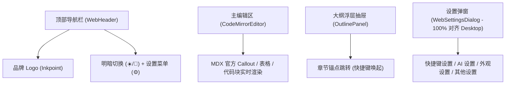

# Web 端（Playground 体验版）架构方案

用途：记录 `apps/web`（`@md-editor/web`）的设计原则、能力边界、与桌面端的共用架构契约以及 Web AI 与无文件树布局方案。

## 1. 核心定位与原则

- **初版定位**：面向官网与在线体验的轻量交互式 Playground 编辑器，做到秒开、沉浸、零门槛体验 Inkpoint 核心亮点能力。
- **架构复用**：
  - 严格复用现有核心领域包（`@md-editor/editor-core`、`@md-editor/renderer-codemirror`、`@md-editor/editor-ui`、`@md-editor/markdown-fidelity`、`@md-editor/mdx-component-registry` 等）。
  - 核心领域能力保持 100% 平台无关，不渗入任何浏览器或特定环境特有耦合。
- **无文件树全宽极简布局**：
  - 桌面端由于管理本地工程，左侧常驻文件树并在树底部的 `DocumentBar` 放置设置按钮；
  - Web 体验版去除文件树，全宽画布聚焦内容创作；
  - 将「设置（⚙️）」按钮重构至顶部导航栏右上角，以弹窗形式唤起，彻底实现无文件树的清爽界面。

## 2. 界面与交互架构

### 功能特性
1. **极致精简纯净的顶部导航栏**：
   - 移除传统冗余工具栏按钮与居中模式切换胶囊，顶部仅保留品牌标志以及右侧的明暗模式切换（☀️/🌙）与偏好设置（⚙️）。
   - 用户完全依靠极简快捷键系统驱动操作，沉浸式书写。
2. **100% 对齐 Desktop 的设置菜单**：
   - 采用与桌面端同源的双栏布局（左侧 190px 导航 TabList + 右侧滚动面板 TabPanels）与 `@headlessui/react` 架构；
   - 结构分为四大标准面板：
     - **快捷键设置 (shortcuts)**：展示命令键位对照表，与桌面端快捷键保持一致；
     - **AI 设置 (ai)**：供应商预设切换（OpenAI / DeepSeek / Ollama 等）、Base URL、API Key、Model 配置与实时连通性测试；
     - **外观设置 (appearance)**：色彩模式（跟随系统/浅色/深色）、5 款内置经典主题（宣纸/GitHub经典/冷灰哥特/炭焙/暗夜）、编辑模式切换以及字号滑块；
     - **其他设置 (other)**：文档导出（下载 Markdown）、复制源码、重置初始演示内容与关于信息。
3. **默认预置演示内容（Showcase）**：
   - 包含多级标题、MDX 官方 Callout（tip / info / warning / danger）、代码高亮、GFM 表格与任务清单。
4. **双模式无缝切换**：
   - 所见即所得（WYSIWYG）↔ 源码模式（Source），光标保持，零闪烁。可通过快捷键 `Mod-/` 或在设置中切换。
5. **滑出式大纲目录（TOC）**：
   - 复用 `@md-editor/editor-ui` 的 `OutlinePanel`，随编辑实时更新，支持快捷键 `Mod-Shift-B` 快速呼出收起。
6. **本地草稿持久化**：
   - 自动在 `localStorage` 中记录最新内容，刷新页面或误关标签后自动还原。

## 3. Web 端 AI 架构

- **接入协议**：支持通用 OpenAI 兼容接口（如 DeepSeek、OpenAI、SiliconFlow，以及本地启动了 CORS 的 Ollama `http://localhost:11434/v1`）。
- **浏览器原生通讯**：通过原生 `fetch()` 发起异步补全请求，无需 Node/Rust 中转。
- **行内建议渲染**：
  - 结合光标前后文构造续写提示；
  - 返回结果后通过 `ports.showSuggestion()` 注入 CodeMirror 6 编辑器，呈现浅灰 Ghost Text；
  - 用户按 `Tab` 键一键采纳，按 `Esc` 键放弃。
  - 支持快捷键 `Mod-Shift-A` 或 `Mod-j` 主动呼出 AI 续写。
- **安全与存储**：API Key 与端点配置完全保存在浏览器本地，绝不经过外部中转。

## 4. 主题复用架构（与桌面端同源）

- **抽离沉淀**：将桌面端 5 款内置主题的 CSS 变量生成与枚举提取至 `@md-editor/editor-ui`（`built-in-themes.ts`）：
  - 浅色：宣纸 (`paper-light`)、GitHub 经典 (`github-light`)、冷灰哥特 (`gothic-light`)
  - 深色：炭焙 (`charcoal-dark`)、暗夜 (`night-dark`)
- **同源变量**：Web 端与桌面端统一使用 `builtInThemeCss()` 注入基础调色盘变量，并通过 `document.documentElement` 同步 `data-theme-scheme` 与 `data-theme-builtin`，保证两端视觉体验高度一致，未来新增主题零维护负担。

## 5. 快捷键系统

- **底层契约**：复用 `@md-editor/editor-ui` 导出的 `matchesRuntimeKeymap(event, keymap)`，统一处理 Mac (`Meta`) 与 Windows/Linux (`Ctrl`) 的 `Mod` 映射以及 IME 组合键屏蔽。
- **核心热键**：
  - `Mod-/`：无缝切换源码 / 所见即所得模式
  - `Mod-Shift-B`：展开 / 收起右侧大纲抽屉
  - `Mod-,`：呼出设置弹窗
  - `Mod-s`：一键导出 Markdown
  - `Mod-Shift-A` / `Mod-j`：触发 AI 智能续写
  - `Escape`：优先关闭设置弹窗/大纲抽屉，未开启时关闭编辑器 Ghost Text 续写建议
- **输入聚焦保护**：当在设置弹窗表单元素中输入时，放行常规字符键入，仅保留 `Escape` 关闭交互。
