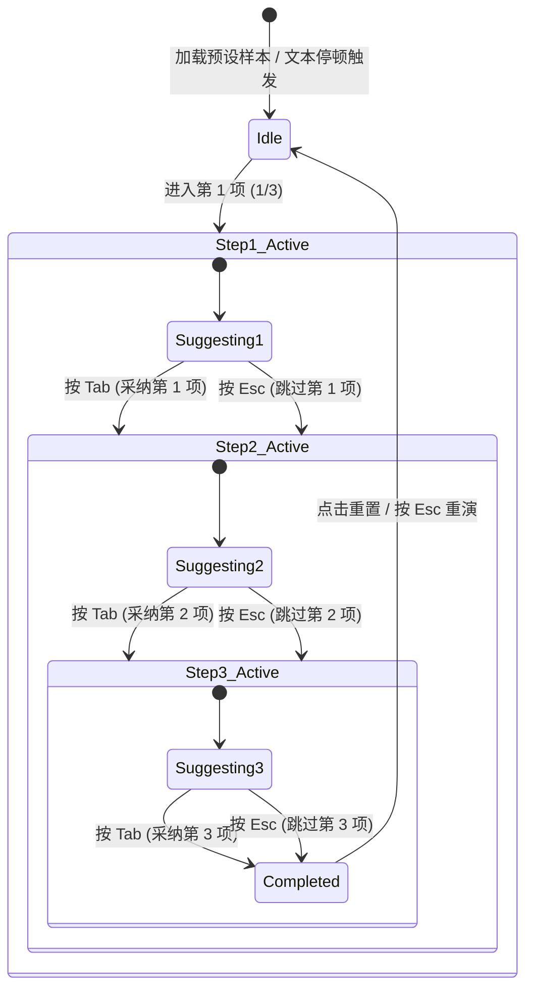

# AI 建议视觉与交互规范（宣纸墨韵与端侧智能设计系统）

## 1. 概述与设计哲学

在 Inkpoint 中，AI 能力遵循 **“非侵入式驻留、无打扰伴随”（Ambient Intelligence）** 与 **“零云端延迟、端侧本地闭环”（Local-First Privacy）** 的设计哲学。

写作是一种高专注度的沉思活动。传统 AI 交互常见突兀的弹出式 Modal、打断思路的侧边栏对话框或闪烁浮动的工具条，这些都会强行打断作者的心流（Flow State）。
Inkpoint 将 AI 建议视为 **“纸张上未干的淡淡墨痕”**——在作者停笔沉思时静默显现，轻触即入篇章，无意则随风而逝。

本文档总结并规范在官网体验与桌面端核心编辑器中沉淀的 AI 建议视觉与交互设计系统，涵盖**行内灵犀续写（Ghost Text Continuation）**与**语病标点连贯修复（Diff Correction & Polish）**两大核心模态。

---

## 2. 双模态视觉契约（Visual Design Tokens）

### 模态一：行内灵犀续写（Ghost Text Continuation）

续写模式用于作者停笔时的思想延续。其核心在于“若隐若现的墨意与手稿感”。

1. **字体排印与色彩（Typography & Palette）**：
   - **字形**：衬线斜体 `font-serif italic`，模拟文人稿纸上的批注手稿；
   - **墨色**：低饱和墨色阶 `text-ink/40`（暗色模式下为柔和象牙白 `text-ink/35`），与正文的实色墨水 `text-ink` 形成克制而分明的层级；
   - **交互悬浮**：鼠标悬停于建议文本时，色阶平滑过渡至 `hover:text-ink/65`，提供亲和的物理触觉响应。
2. **悬浮修饰线条（Affordance Underline）**：
   - 悬浮或聚焦时展示琥珀金微波浪下划线：`decoration-accent/40 decoration-wavy underline-offset-4`；
   - 绝不使用突兀的强对比荧光背景，仅以微波粼粼的笔触暗示其为“待定词句”。
3. **呼吸光标微动（Breathing Caret）**：
   - 在幽灵文本前/后驻留墨色呼吸条：`inline-block h-5 w-[2px] animate-pulse bg-ink align-baseline`；
   - 呼吸节奏与思考律动同频，呼吸动画周期约 1.5s，呈现生命力而非机械闪烁。
4. **采纳融入（Seamless Merging）**：
   - 采纳时通过 `transition-all duration-300` 平滑去除斜体与浅色，文字变为正规无衬线/正文字体 `text-ink font-normal`，仿佛墨水真正浸润入纸。

### 模态二：语病标点连贯修复（Diff Correction & Polish）

修复模式用于自动感知文稿中的语法疏漏、标点混用（如全半角误用）与语序语病。其核心在于“清晰明确的比对（Diff）与轻巧的决策负担”。

1. **错误原文样式（Original Error Token）**：
   - 采用低饱和柔和红底与删除线：`line-through bg-danger/10 text-danger/80 px-1 py-0.5 rounded-sm`；
   - 严禁大面积刺眼的纯红警告，降低用户的焦虑感。
2. **修复候选词样式（Replacement Token）**：
   - 采用温润的翡翠绿底与深绿文本：`bg-emerald-50 text-emerald-700 font-normal px-1.5 py-0.5 rounded-sm ring-1 ring-emerald-600/20`；
   - 替换词紧邻错误词展示，一目了然。
3. **行内伴随决策徽标（Inline Action Badge）**：
   - 在当前聚焦处理的错误项旁，紧随轻量胶囊徽标：
     `inline-flex items-center gap-1 rounded-full bg-accent/10 px-2 py-0.5 text-[11px] font-medium text-accent ring-1 ring-accent/20`；
   - 徽标文字结构：`Tab 接受 (x/n) · Esc 忽略`，清晰传递步进进度与按键契约。
4. **已处理与完成态**：
   - 单项采纳：原词隐去，替换词自然转为正文色 `text-ink`；
   - 单项跳过：保留原词，移除高亮标记与徽标；
   - 全部完成：状态条显示 `已全部校对完成` 并伴随绿色 Checkmark 动效。

---

## 3. 拟物实体按键微交互（Tactile Keycap Controls）

无论在桌面端还是官网交互展区，键盘始终是创作者的第一输入界面。我们设计了具有物理按压质感的微交互键帽（Tactile Keycaps）：

1. **键帽材质（Keycap Material）**：
   - 外层按键：`border border-line-strong bg-canvas px-3.5 py-2 text-xs font-semibold text-ink shadow-[0_2px_0_rgba(20,18,15,0.08)]`；
   - 内嵌按键字符（`<kbd>`）：`rounded-md border border-line bg-surface px-1.5 py-0.5 font-mono text-[10px] text-muted`；
2. **物理按压反馈（Depression Physics）**：
   - 按下瞬间（Active 状态）：`active:translate-y-[1px] active:shadow-none`，模拟机械键盘微动触底的行程阻尼感；
3. **多步进度指示灯（Step Indicator Dots）**：
   - 连贯操作时展示当前进度指示灯组：
     - 已完成步：`h-1.5 w-1.5 rounded-full bg-accent`；
     - 未完成步：`h-1.5 w-1.5 rounded-full bg-line-strong/60`；
   - 辅助文案提示当前为第几步（如 `(1/3)`）。

---

## 4. 多步推进状态机模型（Multi-Step Sequential State Machine）

用户强调“不要只有一下，要连贯推进”。无论是连续补全多句，还是依次纠正多处语病，均遵循以下严格的状态迁移协议：

### 按键契约矩阵（Key Binding Matrix）

| 场景 | 当前状态 | 按键 `Tab` | 按键 `Escape` | 点击正文建议 |
| :--- | :--- | :--- | :--- | :--- |
| **语病标点修复** | 待处理 `(1/3)` | 采纳第 1 项，光标与 Badge 自动跳至第 2 项 | 跳过第 1 项（保留原词），跳至第 2 项 | 等同于按 `Tab` 采纳当前项 |
| **语病标点修复** | 待处理 `(3/3)` | 采纳最后一项，进入全部完成态 | 跳过最后一项，进入完成态 | 采纳最后一项 |
| **语病标点修复** | 全部完成 | 无动作 / 重播演示 | 一键复原演示至第 1 步 | 触发重新开始 |
| **行内灵犀续写** | 续写建议中 `(1/3)` | 融入第 1 句，立即呈现第 2 句幽灵文本 | 立即取消整个续写序列，清除幽灵文本 | 等同于按 `Tab` 融入第 1 句 |
| **行内灵犀续写** | 续写建议中 `(3/3)` | 融入第 3 句，整段落笔成章，进入完成态 | 取消当前句续写 | 融入最后一处 |
| **行内灵犀续写** | 全部完成 | 无动作 | 一键复原至初始未续写状态 | 触发重新开始 |

---

## 5. 对未来核心编辑器（packages/renderer-codemirror）的落地建议

本次改动根据架构隔离边界原则严格限制在 `site` 前端层面。未来在桌面端核心编辑器引入该设计系统时，建议遵循以下接入规范：

1. **行内续写装饰器（Ghost Text Decoration）**：
   - 采用 CodeMirror 6 `Decoration.widget` 注入具有 `font-serif italic text-ink/40` 的行内元素；
   - 监听 `keymap` 中的 `Tab` 优先级高于默认缩进，若存在活跃 Ghost Text 则派发 `acceptGhostText` Transaction；
2. **语病修复标记（Linter & Diagnostic Mark）**：
   - 采用 `Decoration.mark` 施加删除线与背景高亮，通过 `StateField` 维护当前活跃的 Diagnostic 索引；
   - 提供浮动/行内 Tooltip 渲染 `Tab 接受 · Esc 忽略` 微按钮，确保与键盘单键操作完全同构；
3. **撤销与重做树友好（Undo/Redo Invariant）**：
   - 连续多步采纳应打入同一个 `TransactionSpec` 或记录清晰的 step 历史，允许创作者通过 `Cmd+Z` 逐次或整体撤销。
